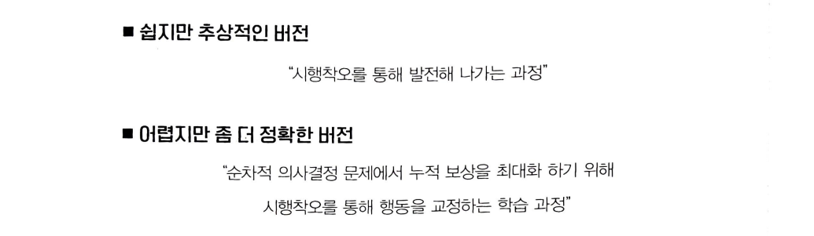

# Chapter 01 강화 학습이란?

## 1.1 지도 학습과 강화 학습

**지도 학습(supervised learning)** - 지도자의 도움을 받아 학습

**강화 학습(reinforcement learning)** - 시행착오(trial and error)를 통해 학습

### 기계 학습의 분류

### 지도 학습

### 강화 학습

## 1.2 순차적 의사결정 문제

강화 학습이 풀고자 하는 문제 → **순차적 의사결정(sequential decision making)**

### 샤워하는 남자

순서가 

뒤바뀐다면

각 상황에 따라 하는 행동이 다음 상황에 영향을 준다

→ 연이은 행동을 잘 선택해야 한다!

### 순차적 의사결정 문제의 예시

주식 투자에서의 포트폴리오 관리

운전

게임

## 1.3 보상

**보상(reward)** : 의사결정을 얼마나 잘하고 있는지 알려주는 신호

→ **누적 보상(cumulative reward) 을 최대화하는 것**

1. 어떻게 X 얼마나 O

“어떻게” 에 대한 정보를 담고 있지 않다 →  수많은 시행착오를 통해 학습해 나감

1. 스칼라

여러 가지 목표 → 각 목표에 가중치를 두어서 스칼라로 변환

1. 희소하고 지연된 보상

## 1.4 에이전트와 환경

**에이전트(Agent)** : 학습의 주체, **환경(Environment)** 속에서 행동하는 개체

현재 상태에 대한 모든 정보 - **상태(state)**

하나의 루프가 끝나면 **한 틱(tick)이 지났다**고 표현

## 1.5 강화 학습의 위력

### 병렬성의 힘

병렬성을 통해 빠르게 학습 가능

각 컴퓨터에서 진행된 시뮬레이션 결과는 중앙으로 모이게 됨

### 자가 학습(self-learning)의 매력
