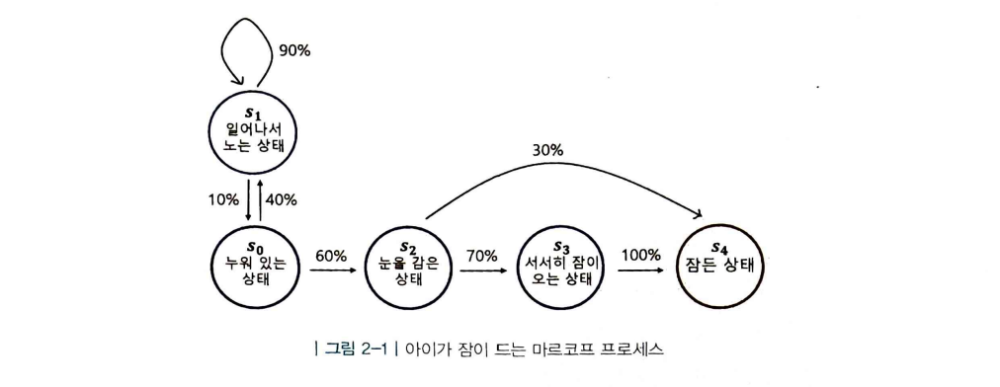
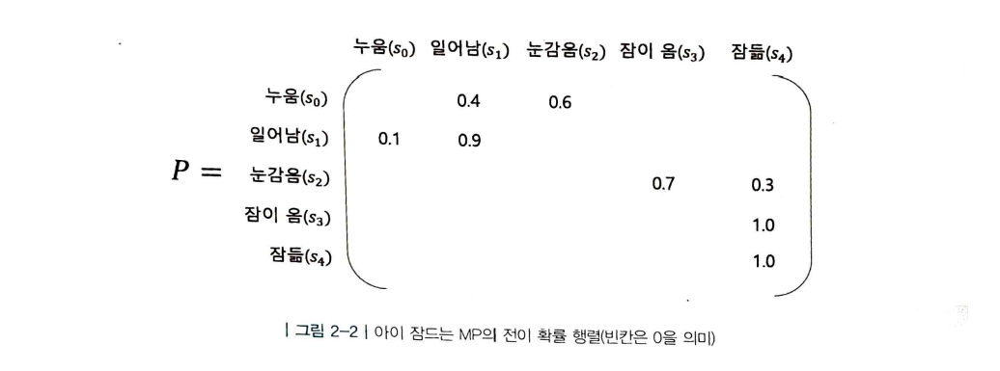
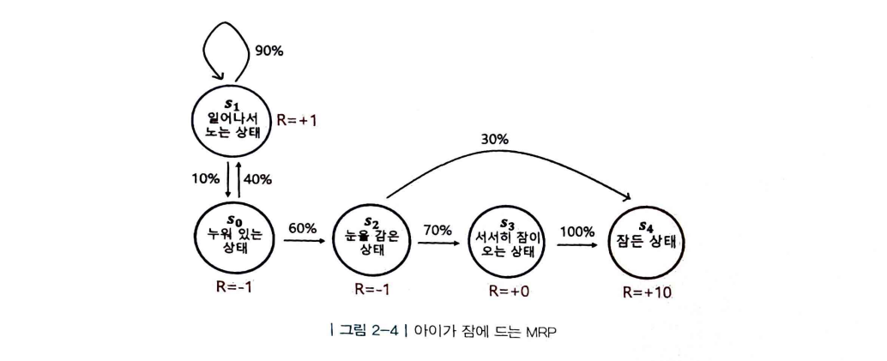
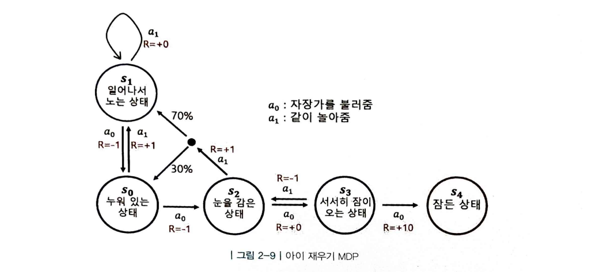
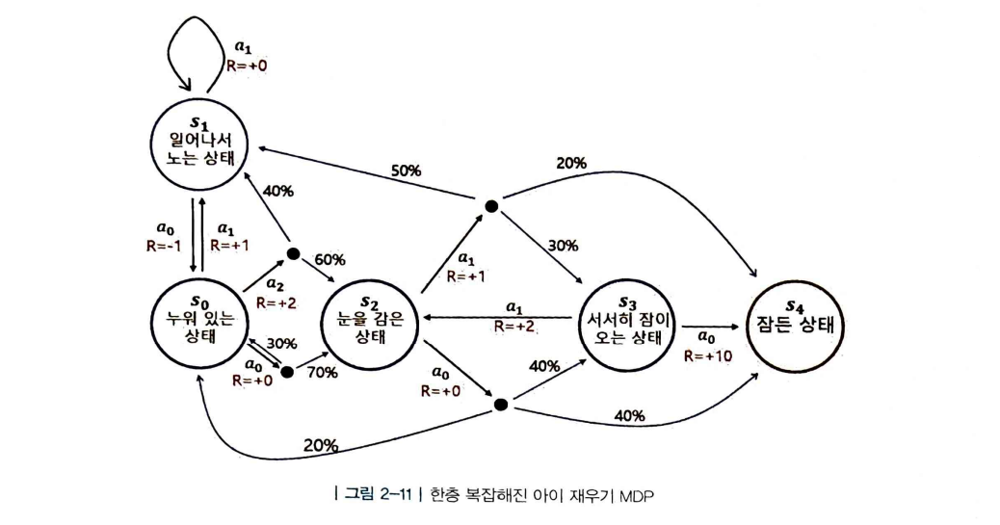

# Chapter 02 마르코프 결정 프로세스(Markov Decision Process)

순차적 의사결정 문제 → **MDP(Markov Decision Process)**를 통해 정확하게 표현할 수 있음

## 2.1 마르코프 프로세스(Markov Process)

### 아이가 잠이 드는 마르코프 프로세스

아이가 취할 수 있는 상태
s0: 누워 있는 상태
s1: 일어나서 노는 상태
s2: 눈을 감은 상태
s3:  서서히 잠이 오는 상태
s4: 잠든 상태

각 상태에 진입하게 되면 1분씩 머무른 후 다음 상태로 **상태 전이(state transition)**

s4는 **종료 상태(terminal state)**로, 도달하는 순간 마르코프 프로세스가 끝남

$$
MP≡(S,P)
$$

- 상태의 집합 $S$
    
    가능한 상태들을 모두 모아놓은 집합
    
- 전이 확률 행렬 $P_{SS'}$
    
    **전이 확률(transition probability) :** 상태 s에서 다음 상태 s’에 도착할 확률
    
    
    

마르코프 프로세스는 **정해진 간격**으로 상태가 바뀜

각 상태 s와 s’에 대해 행렬의 형태로 표현이 가능 → 전이 확률 행렬

### 마르코프 성질

“미래는 오로지 현재에 의해 결정된다.”

- 마르코프한 상태 - 체스

과거가 어떠했는지는 상관이 없고, 오로지 현재 상태로만 미래를 결정

- 마르코프하지 않은 상태 - 운전

과거가 현재 상태의 선택에 영향을 끼쳐 미래를 결정

→ 시점에 대한 이미지를 묶어 제공하여 조금이라도 더 마르코프하게 제공

## 2.2 마르코프 리워드 프로세스(Markov Reward Process)

### 아이가 잠이 드는 MRP

MP에 **$R$(보상 함수)**와 **γ(감쇠 인자)** 요소가 추가되면 MRP

$$
MRP≡(S,P,R,γ)
$$

- 보상 함수 $R$
    
    어떤 상태 s에 도착했을 때 받게 되는 보상
    
    $$
    R = \mathbb{E}[R_t \mid S_t = s]
    $$
    
- 감쇠 인자 γ
    
    0에서 1사이의 숫자로, 미래의 보상에 비해 당장 얻는 보상을 얼마나 더 중요하게 여길 것인지에 대한 파라미터
    
    미래에 얻을 보상의 값에 여러 번 곱해지며 값을 작게 만드는 역할
    
    **리턴**: 현재부터 미래에 얻게 될 보상의 합
    

### 감쇠된 보상의 합, 리턴

$$
s_0,R_0,s_1,R_1,s_2,R_2,...,s_T,R_T
$$

이와 같은 하나의 여정 → **에피소드**

$$
G_t = R_{t+1}+γR_{t+2}+γ^2R_{t+3}+...
$$

→ 강화 학습은 리턴 G를 최대화하도록 학습하는 것

### γ는 왜 필요할까?

- 수학적 편리성

G_t가 무한의 값을 가지는 것을 방지함

- 사람의 선호 반영

사람은 기본적으로 당장 벌어지는 눈 앞의 보상을 더 선호함

- 미래에 대한 불확실성 반영

미래 가치의 불확실성 반영을 위해 감쇠

### MRP에서 각 상태의 밸류 평가하기

어떤 상태를 평가할 때 → 그 시점으로부터 미래에 일어날 보상을 기준으로 평가

이때, 리턴은 항상 변함 → 리턴의 **기댓값(Expectation)** 사용

### 에피소드의 샘플링

**샘플링(sampling)** : 어떤 확률 분포가 있을 때, 해당 분포에서 샘플을 뽑아보는 것

이때, 실제 확률 분포를 모르는 경우가 대부분 → 샘플링을 통해 유추하는 방법론 사용

### 상태 가치 함수(State Value Function)

$$
v(s) = \mathbb{E}[G_t \mid S_t = s]
$$

## 2.3 마르코프 결정 프로세스(Markov Decision Process)

### MDP의 정의

$$
MDP≡(S,A,P,R,γ)
$$

- 액션의 집합 A
    
    에이전트가 취할 수 있는 액션의 집합
    

### 아이 재우기 MDP

**정책(policy)** : 각 상태에 따라 어떤 액션을 선택해야 보상의 합을 최대로 할 수 있는가

### 정책 함수와 2가지 가치 함수

- 정책 함수
    
    각 상태에서 어떤 액션을 선택할지 정해주는 함수
    
- 상태 가치 함수(state value function) v(s)
    
    정책 함수를 따랐을 때 리턴의 기대값
    
- 액션 가치 함수(action value function) q(s,a)
    
    해당 상태의 특정 액션을 선택한 후 정책 함수를 따랐을 때 리턴의 기대값
    

## 2.4 Prediction과 Control

1. **Prediction** : π가 주어졌을 때 각 상태의 밸류를 평가하는 문제
2. **Control** : 최적 정책 π*를 찾는 문제
